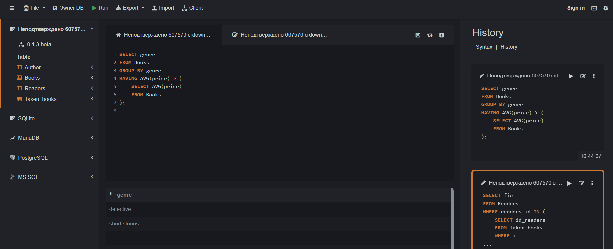
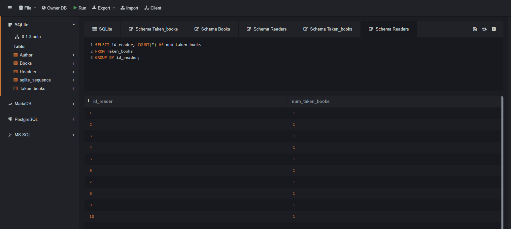
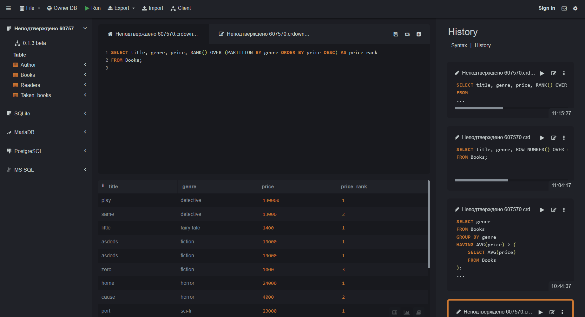
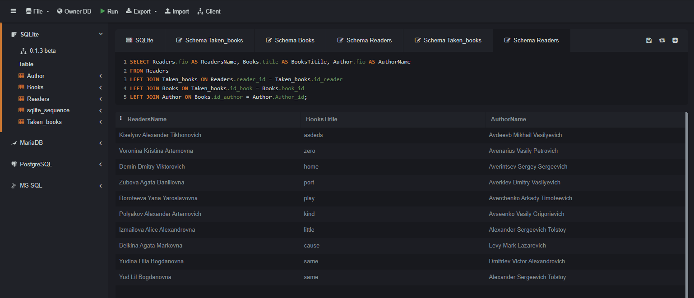
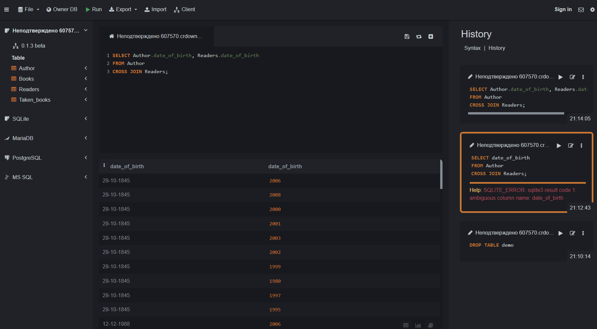
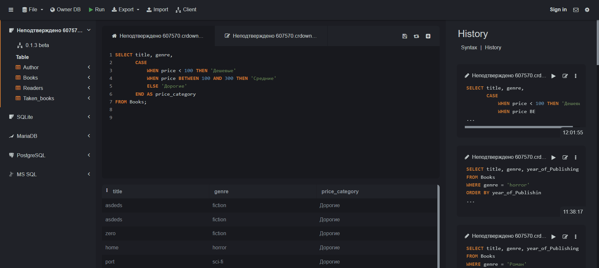

# Синтяева Елена Витальевна ИС/22-9-1

## 2. Описание базы данных "Library"

Эта База данных используется для упарвления информацией о книгах, читателях, авторах и арендованных книгах.


### 2.1 Таблица book


 - id (INTEGER, PRIMARY KEY AUTOINCREMENT) - уникальный идентификатор книги
 - title (VARCHAR(50)) - название книги
 - price (INT) - цена книги
 - genre (VARCHAR(50)) - жанр книги
 - year_of_publishing (DATE) - год издания книги
 - author_id (INT) - идентификатор автора книги, связан с таблицей Author по полю Author_id

```
SELECT * FROM book;
```

 ### 2.2 Таблица taken_book:


 - id (INTEGER, PRIMARY KEY AUTOINCREMENT) - уникальный идентификатор взятой книги
 - book_id (INT) - идентификатор книги, связан с таблицей Books по полю booksID
 - reader_id (INT) - идентификатор читателя, связан с таблицей Readers по полю readers_id
 - date_of_collection (VARCHAR) - дата получения книги
 - date_of_return (VARCHAR) - дата возврата книги
Связи: таблица связана с таблицами Books (по id_books) и Readers (по id_readers)

```
SELECT * FROM taken_book;
```


### 2.3 Таблица reader:


 - id (INTEGER, PRIMARY KEY AUTOINCREMENT) - уникальный идентификатор читателя
 - fio (VARCHAR(50)) - ФИО читателя
 - telephone (VARCHAR(50)) - телефон читателя
 - e_mail (VARCHAR(50)) - электронная почта читателя
 - date_of_birth (VARCHAR(50) - дата рождения читателя
   
```
SELECT * FROM reader;
```


### 2.4 Таблица author:


 - id (INTEGER, PRIMARY KEY AUTOINCREMENT) - уникальный идентификатор автора
 - fio (VARCHAR(50)) - ФИО автора
 - date_of_birth (DATE) - дата рождения автора
 - title_of_books (VARCHAR(50)) - название книги

```
SELECT * FROM author;
```


## 3. UNION
```
SELECT title AS Name
FROM book
UNION
SELECT fio AS Name
FROM reader;
```

  
- Результат

Name - общее название для имен из столбцов "title" и "fio"

Таблица будет состоять из уникальных значений из столбцов "title" таблицы "Books" и "fio" таблицы "Readers", объединенных в общем столбце "Name"

## 4. ORDER BY
```
SELECT title, price
FROM book
ORDER BY price DESC;
```

- Результат
1. title - название книги
2. price - цена книги

Таблица будет отсортирована по столбцу "price" по убыванию, то есть книги будут расположены в порядке от самой дорогой книги до самой дешевой.

## 5. HAVING
```
SELECT genre, AVG(price) AS AvgPrice
FROM book
GROUP BY genre
HAVING AVG(price) > 500;
```

- Результат
1. genre - жанр книги
2. AvgPrice - средняя цена книги в данном жанре

Таблица будет содержать только те жанры книг, где средняя цена книги превышает 500, вместе с соответствующими средними ценами.

## 6. Вложеный Запрос

### 6.1 SELECT
```
SELECT title, price, price - (SELECT AVG(price) FROM book) AS "Разница"
FROM book
WHERE price - (SELECT AVG(price) FROM Books) > 0;
```


- Результат

Таблица будет  содержать список книг, у которых цена выше средней цены всех книг

### 6.2 WHERE 
```
SELECT genre
FROM book
GROUP BY genre
HAVING AVG(price) > (
    SELECT AVG(price)
    FROM book
);
```


- Результат 

Этот запрос выбирает жанры книг, у которых средняя цена выше средней цены по всем книгам в таблице

## 7. Оконные функции 

### 7.1 Агрегатные функции
```
SELECT reader_id, COUNT(*) AS num_taken_books
FROM taken_book
GROUP BY reader_id;
```

- Результат 

 Количество взятых книг для каждого читателя из таблицы Taken_books. Затем результаты группируются по id_readers с использованием функции COUNT(*) для подсчета числа взятых книг каждым читателем.

### 7.2 Ранжирующие функции
```
SELECT title, genre, price, RANK() OVER (PARTITION BY genre ORDER BY price DESC) as price_rank
FROM book;
```


- Результат 

 Книги упорядочены по жанру, а затем по цене в убывающем порядке в рамках каждого жанра

### 7.3 Функции смещения
```
SELECT title, genre, year_of_publishing
FROM book
WHERE genre = 'horror'
ORDER BY year_of_publishing
LIMIT 3 OFFSET 1;
```

- Результат

Запрос запрос создаст таблицу, содержащую информацию о трех книгах в жанре "horror", начиная со второй по дате публикации

## 8. JOIN 

### 8.1 INNER JOIN
```
SELECT reader.fio AS ReadersName, book.title, author.fio AS AuthorName, taken_book.date_of_collection
FROM taken_book
INNER JOIN book ON taken_book.id = book.id
INNER JOIN reader ON taken_book.reader_id = reader.id
INNER JOIN author ON book.author_id = author.id;
```

- Результат

Каждая строка в результате будет представлять информацию о конкретной книге, взятой читателем, включая название книги, имя автора, имя читателя и дату взятия книги

### 8.2 LEFT JOIN
```
SELECT reader.fio AS ReadersName, book.title AS BooksTitile, author.fio AS AuthorName
FROM readers
LEFT JOIN taken_book ON reader.reader_id = Taken_books.reader_id
LEFT JOIN Books ON taken_book.book_id = Books.id
LEFT JOIN author ON book.author_id = author.id;
```

- Результат

Каждая строка в результате будет представлять информацию о конкретной книге, взятой читателем, включая название книги, имя автора и имя читателя

### 8.3 RIGHT JOIN
```
SELECT book.title AS BooksTitle, reader.fio AS ReadersName, author.fio as AuthorName
FROM Books
RIGHT JOIN taken_book ON book.book_id = taken_book.book_id
RIGHT JOIN reader ON taken_book.reader_id = reader.id
RIGHT JOIN author ON book.author_id = author.id;
```

- Результат

Каждая строка представляет информацию о конкретной книге, включая данные о читателе, названии книги и авторе

### 8.4 FULL OUTER JOIN 
```
SELECT book.title AS BooksTitle, reader.fio AS ReadersName, author.fio as AuthorName
FROM Books
FULL OUTER JOIN taken_books ON book.book_id = taken_book.id
FULL OUTER JOIN reader ON taken_book.id_reader = reader.id
FULL OUTER JOIN author ON book.author_id = author.id;
```

- Результат

 Таблица будет содержать информацию о книгах, именах читателей, именах авторов и связях между ними на основе указанных ключей

### 8.5 CROSS JOIN
```
SELECT author.date_of_birth, reader.date_of_birth
FROM author
CROSS JOIN reader;
```

- Результат

Таблица будет содержать все возможные комбинации дат рождения авторов и читателей из исходных таблиц Author и Readers

## 9. CASE 
```
SELECT title, genre,
       CASE
           WHEN price < 100 THEN 'Дешевые'
           WHEN price BETWEEN 100 AND 300 THEN 'Средние'
           ELSE 'Дорогие'
       END AS price_category
FROM book;
```


- Результат

Этот запрос выбирает поля title и genre из таблицы Books, а также добавляет дополнительное вычисляемое поле price_category, которое определяет категорию цен для каждой книги на основе её цены

## 10. WITH
```
WITH readers_taken_book AS 
	(SELECT reader.* FROM T=taken_book
     	INNER JOIN reader on reader.id = taken_book.id)
SELECT * FROM reader_taken_books;
```

- Результат

 Таблица будет содержать все столбцы из таблицы Readers, отфильтрованные по читателям, которые взяли книги. Каждая строка результата будет представлять информацию о читателе, который взял книгу
