# Синтяева Елена Витальевна ИС/22-9-1

## Описание

Эта База данных используется для упарвления информацией о книгах, читателях, авторах и арендованных книгах.

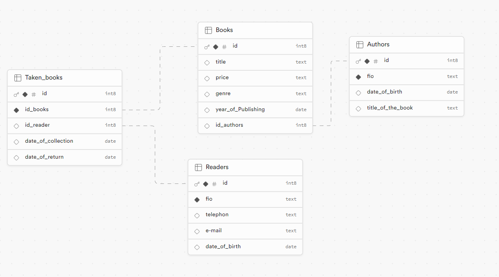


### Таблица Books
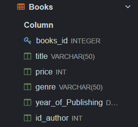

 - booksID (INTEGER, PRIMARY KEY) - уникальный идентификатор книги
 - title (VARCHAR(50)) - название книги
 - price (INT) - цена книги
 - genre (VARCHAR(50)) - жанр книги
 - year_of_Publishing (DATE) - год издания книги
 - id_author (INT) - идентификатор автора книги, связан с таблицей Author по полю Author_id

 ### Таблица Taken_books:


 - Taken_books_id (INTEGER, PRIMARY KEY) - уникальный идентификатор взятой книги
 - id_books (INT) - идентификатор книги, связан с таблицей Books по полю booksID
 - id_readers (INT) - идентификатор читателя, связан с таблицей Readers по полю readers_id
 - date_of_collection (TEXT) - дата получения книги
 - date_of_return (TEXT) - дата возврата книги
Связи: таблица связана с таблицами Books (по id_books) и Readers (по id_readers)


### Таблица Readers:
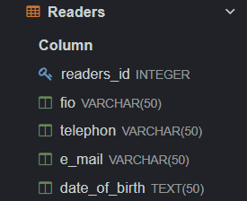

 - readers_id (INTEGER, PRIMARY KEY) - уникальный идентификатор читателя
 - fio (VARCHAR(50)) - ФИО читателя
 - telephone (VARCHAR(50)) - телефон читателя
 - e_mail (VARCHAR(50)) - электронная почта читателя
 - date_of_birth (TEXT) - дата рождения читателя


### Таблица Author:
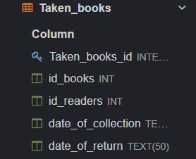

 - Author_id (INTEGER, PRIMARY KEY) - уникальный идентификатор автора
 - fio (VARCHAR(50)) - ФИО автора
 - date_of_birth (TEXT) - дата рождения автора

## UNION
```
SELECT title AS Name
FROM Books
UNION
SELECT fio AS Name
FROM Readers;
```
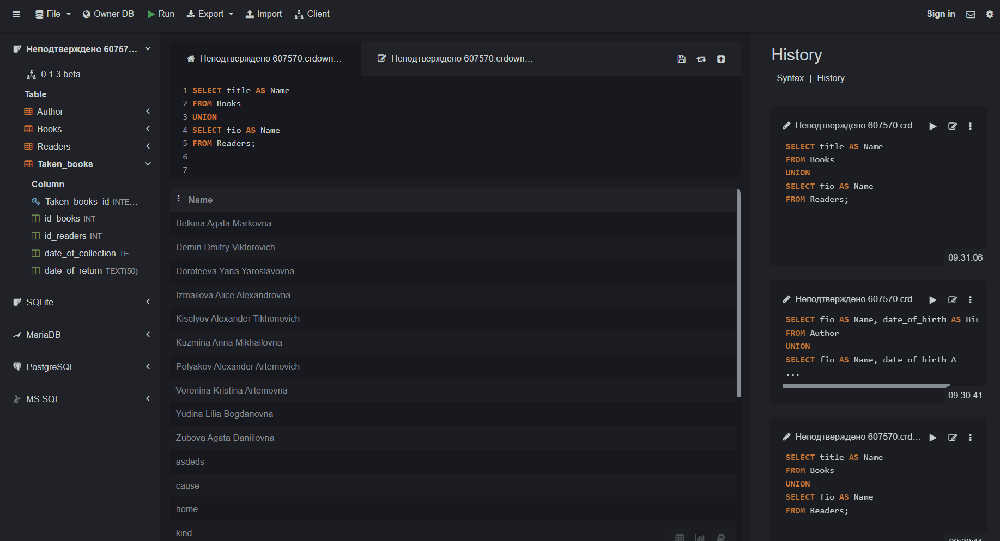
  
- Результат

Name - общее название для имен из столбцов "title" и "fio"

Таблица будет состоять из уникальных значений из столбцов "title" таблицы "Books" и "fio" таблицы "Readers", объединенных в общем столбце "Name"

## ORDER BY
```
SELECT title, price
FROM Books
ORDER BY price DESC;
```

- Результат
1. title - название книги
2. price - цена книги

Таблица будет отсортирована по столбцу "price" по убыванию, то есть книги будут расположены в порядке от самой дорогой книги до самой дешевой.

## HAVING
```
SELECT genre, AVG(price) AS AvgPrice
FROM Books
GROUP BY genre
HAVING AVG(price) > 500;
```
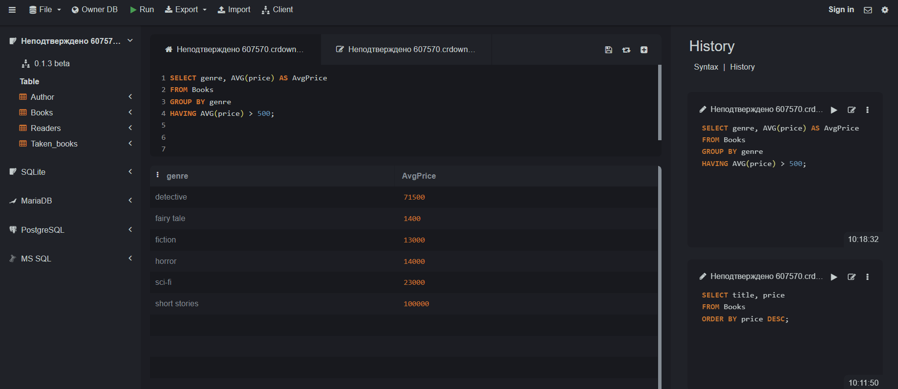
- Результат
1. genre - жанр книги
2. AvgPrice - средняя цена книги в данном жанре

Таблица будет содержать только те жанры книг, где средняя цена книги превышает 500, вместе с соответствующими средними ценами.

## Вложеный Запрос

### SELECT
```
SELECT genre
FROM Books
GROUP BY genre
HAVING AVG(price) > (
    SELECT AVG(price)
    FROM Books
);
```
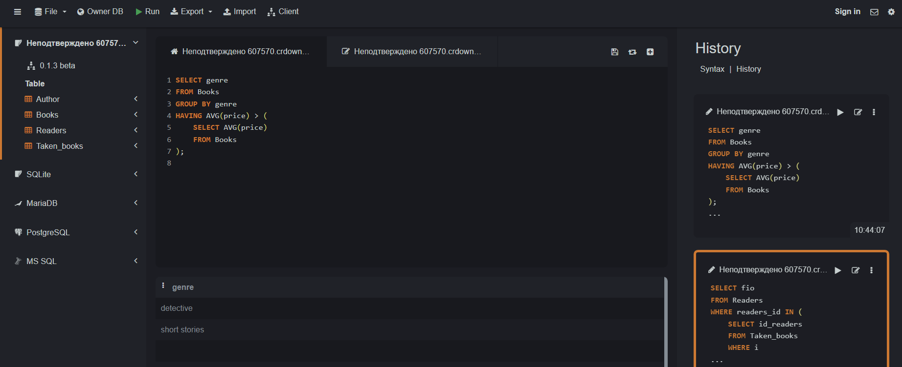

- Результат 

Этот запрос выбирает жанры книг, у которых средняя цена выше средней цены по всем книгам в таблице

## Оконные функции 

### Агрегатные функции
```
SELECT id_readers, COUNT(*) AS num_taken_books
FROM Taken_books
GROUP BY id_readers;
```
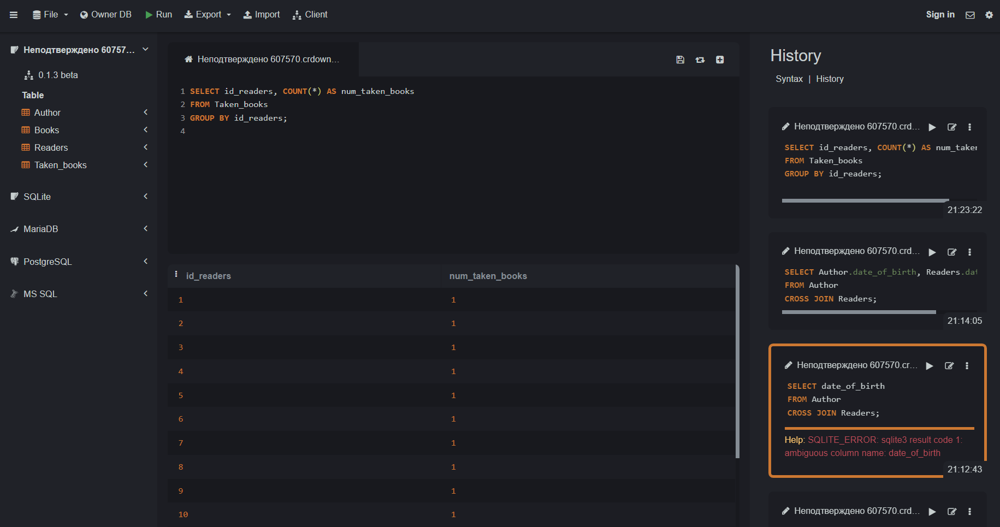
- Результат 

 Количество взятых книг для каждого читателя из таблицы Taken_books. Затем результаты группируются по id_readers с использованием функции COUNT(*) для подсчета числа взятых книг каждым читателем.

### Ранжирующие функции
```
SELECT title, genre, price, RANK() OVER (PARTITION BY genre ORDER BY price DESC) as price_rank
FROM Books;
```
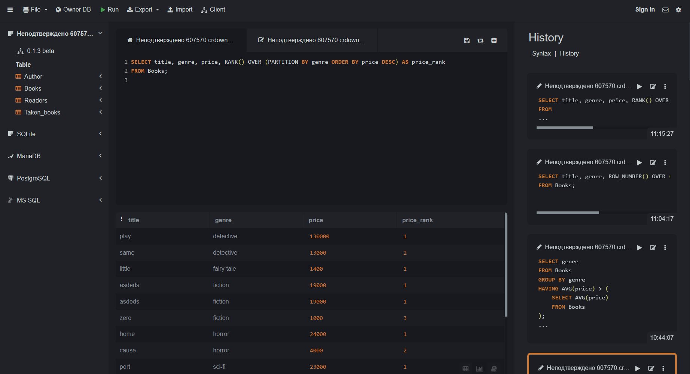

- Результат 

 Книги упорядочены по жанру, а затем по цене в убывающем порядке в рамках каждого жанра

### Функции смещения
```
SELECT title, genre, year_of_Publishing
FROM Books
WHERE genre = 'horror'
ORDER BY year_of_Publishing
LIMIT 3 OFFSET 1;
```
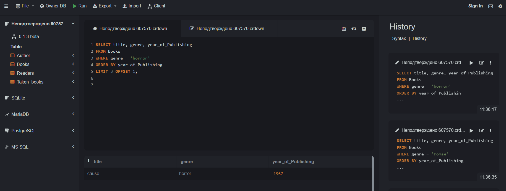
- Результат

Запрос запрос создаст таблицу, содержащую информацию о трех книгах в жанре "horror", начиная со второй по дате публикации

## JOIN 

### INNER JOIN
```
```
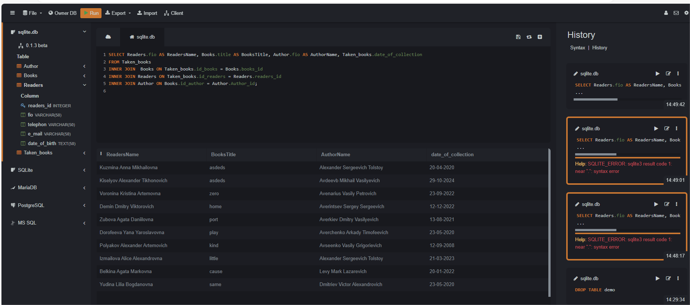
### LEFT JOIN
```
```

### RIGHT JOIN
```
```
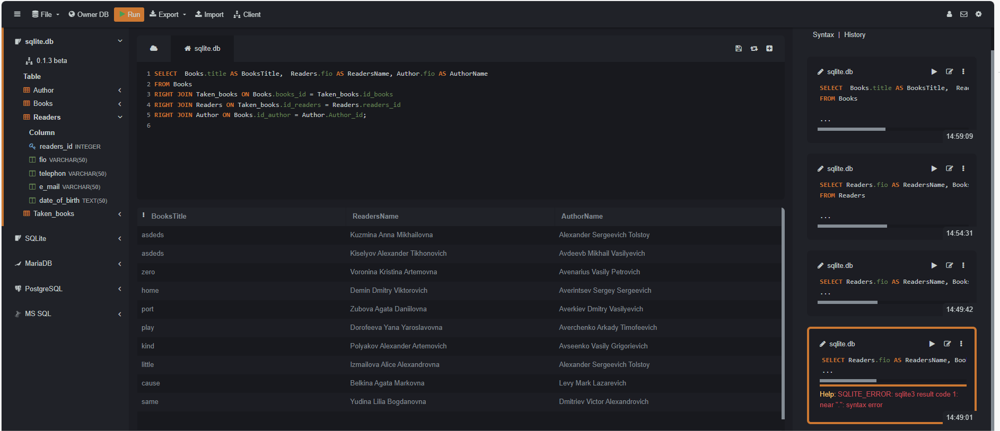
### FULL OUTER JOIN 
```
```
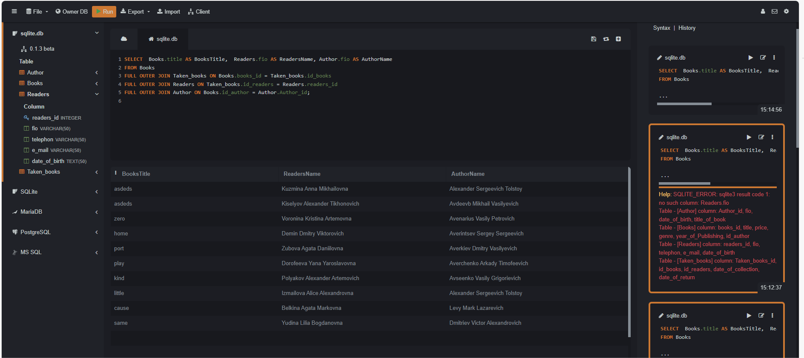
### CROSS JOIN
```
```
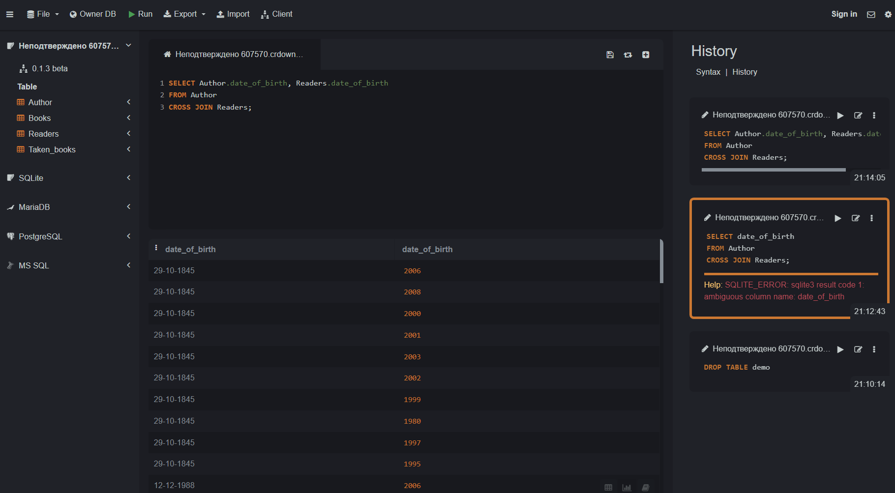
## CASE 
```
```
## WITH
```
```