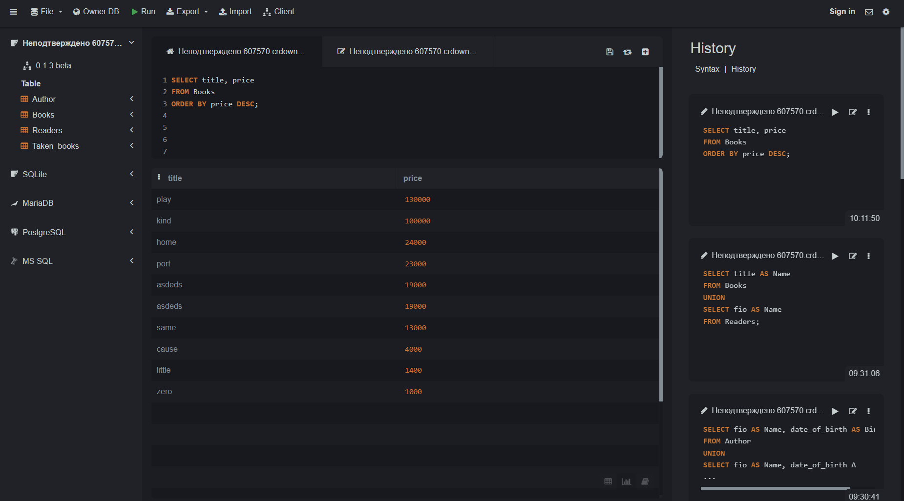
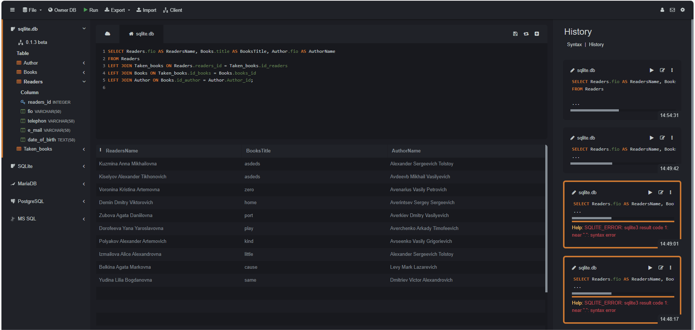

# Синтяева Елена Витальевна ИС/22-9-1

## 2. Описание базы данных "Library"

Эта База данных используется для упарвления информацией о книгах, читателях, авторах и арендованных книгах.


### 2.1 Таблица Books


 - booksID (INTEGER, PRIMARY KEY) - уникальный идентификатор книги
 - title (VARCHAR(50)) - название книги
 - price (INT) - цена книги
 - genre (VARCHAR(50)) - жанр книги
 - year_of_Publishing (DATE) - год издания книги
 - id_author (INT) - идентификатор автора книги, связан с таблицей Author по полю Author_id

 ### 2.2 Таблица Taken_books:


 - Taken_books_id (INTEGER, PRIMARY KEY) - уникальный идентификатор взятой книги
 - id_books (INT) - идентификатор книги, связан с таблицей Books по полю booksID
 - id_readers (INT) - идентификатор читателя, связан с таблицей Readers по полю readers_id
 - date_of_collection (TEXT) - дата получения книги
 - date_of_return (TEXT) - дата возврата книги
Связи: таблица связана с таблицами Books (по id_books) и Readers (по id_readers)


### 2.3 Таблица Readers:


 - readers_id (INTEGER, PRIMARY KEY) - уникальный идентификатор читателя
 - fio (VARCHAR(50)) - ФИО читателя
 - telephone (VARCHAR(50)) - телефон читателя
 - e_mail (VARCHAR(50)) - электронная почта читателя
 - date_of_birth (TEXT) - дата рождения читателя


### 2.4 Таблица Author:


 - Author_id (INTEGER, PRIMARY KEY) - уникальный идентификатор автора
 - fio (VARCHAR(50)) - ФИО автора
 - date_of_birth (TEXT) - дата рождения автора
 - title_of_books (VARCHAR(50)) - название книги 
## 3. UNION
```
SELECT title AS Name
FROM Books
UNION
SELECT fio AS Name
FROM Readers;
```

  
- Результат

Name - общее название для имен из столбцов "title" и "fio"

Таблица будет состоять из уникальных значений из столбцов "title" таблицы "Books" и "fio" таблицы "Readers", объединенных в общем столбце "Name"

## 4. ORDER BY
```
SELECT title, price
FROM Books
ORDER BY price DESC;
```

- Результат
1. title - название книги
2. price - цена книги

Таблица будет отсортирована по столбцу "price" по убыванию, то есть книги будут расположены в порядке от самой дорогой книги до самой дешевой.

## 5. HAVING
```
SELECT genre, AVG(price) AS AvgPrice
FROM Books
GROUP BY genre
HAVING AVG(price) > 500;
```

- Результат
1. genre - жанр книги
2. AvgPrice - средняя цена книги в данном жанре

Таблица будет содержать только те жанры книг, где средняя цена книги превышает 500, вместе с соответствующими средними ценами.

## 6. Вложеный Запрос

### 6.1 SELECT
```
```
### 6.2 WHERE 
```
SELECT genre
FROM Books
GROUP BY genre
HAVING AVG(price) > (
    SELECT AVG(price)
    FROM Books
);
```


- Результат 

Этот выбирает жанры книг, у которых средняя цена выше средней цены по всем книгам в таблице

## 7. Оконные функции 

### 7.1 Агрегатные функции
```
SELECT id_readers, COUNT(*) AS num_taken_books
FROM Taken_books
GROUP BY id_readers;
```

- Результат 

 Количество взятых книг для каждого читателя из таблицы Taken_books. Затем результаты группируются по id_readers с использованием функции COUNT(*) для подсчета числа взятых книг каждым читателем.

### 7.2 Ранжирующие функции
```
SELECT title, genre, price, RANK() OVER (PARTITION BY genre ORDER BY price DESC) as price_rank
FROM Books;
```


- Результат 

 Книги упорядочены по жанру, а затем по цене в убывающем порядке в рамках каждого жанра

### 7.3 Функции смещения
```
SELECT title, genre, year_of_Publishing
FROM Books
WHERE genre = 'horror'
ORDER BY year_of_Publishing
LIMIT 3 OFFSET 1;
```

- Результат

Запрос запрос создаст таблицу, содержащую информацию о трех книгах в жанре "horror", начиная со второй по дате публикации

## 8. JOIN 

### 8.1 INNER JOIN
```
SELECT Readers.fio AS ReadersName, Books.title, Author.fio AS AuthorName, Taken_books.date_of_collection
FROM Taken_books
INNER JOIN Books ON Taken_books.Taken_books_id = Books.books_id
INNER JOIN Readers ON Taken_books.id_readers = Readers.readers_id
INNER JOIN Author ON Books.id_author = Author.Author_id;
```

- Результат

Каждая строка в результате будет представлять информацию о конкретной книге, взятой читателем, включая название книги, имя автора, имя читателя и дату взятия книги

### 8.2 LEFT JOIN
```
SELECT Readers.fio AS ReadersName, Books.title AS BooksTitile, Author.fio AS AuthorName
FROM Readers
LEFT JOIN Taken_books ON Readers.readers_id = Taken_books.id_readers
LEFT JOIN Books ON Taken_books.id_books = Books.books_id
LEFT JOIN Author ON Books.id_author = Author.Author_id;
```

- Результат

Каждая строка в результате будет представлять информацию о конкретной книге, взятой читателем, включая название книги, имя автора и имя читателя

### 8.3 RIGHT JOIN
```
SELECT Books.title AS BooksTitle, Readers.fio AS ReadersName, Author.fio as AuthorName
FROM Books
RIGHT JOIN Taken_books ON Books.books_id = Taken_books.id_books
RIGHT JOIN Readers ON Taken_books.id_readers = Readers.readers_id
RIGHT JOIN Author ON Books.id_author = Author.Author_id;
```

- Результат

Каждая строка представляет информацию о конкретной книге, включая данные о читателе, названии книги и авторе

### 8.4 FULL OUTER JOIN 
```
SELECT Books.title AS BooksTitle, Readers.fio AS ReadersName, Author.fio as AuthorName
FROM Books
FULL OUTER JOIN Taken_books ON Books.books_id = Taken_books.id_books
FULL OUTER Readers ON Taken_books.id_readers = Readers.readers_id
FULL OUTER Author ON Books.id_author = Author.Author_id;
```

- Результат

 Таблица будет содержать информацию о книгах, именах читателей, именах авторов и связях между ними на основе указанных ключей

### 8.5 CROSS JOIN
```
SELECT Author.date_of_birth, Readers.date_of_birth
FROM Author
CROSS JOIN Readers;
```

- Результат

Таблица будет содержать все возможные комбинации дат рождения авторов и читателей из исходных таблиц Author и Readers

## 9. CASE 
```
SELECT title, genre,
       CASE
           WHEN price < 100 THEN 'Дешевые'
           WHEN price BETWEEN 100 AND 300 THEN 'Средние'
           ELSE 'Дорогие'
       END AS price_category
FROM Books;
```


- Результат

Этот запрос выбирает поля title и genre из таблицы Books, а также добавляет дополнительное вычисляемое поле price_category, которое определяет категорию цен для каждой книги на основе её цены

## 10. WITH
```
WITH Readers_taken_books AS 
	(SELECT Readers.* FROM Taken_books 
     	INNER JOIN Readers on Readers.readers_id = Taken_books.Taken_books_id)
SELECT * FROM Readers_taken_books;
```

- Результат

 Таблица будет содержать все столбцы из таблицы Readers, отфильтрованные по читателям, которые взяли книги. Каждая строка результата будет представлять информацию о читателе, который взял книгу
